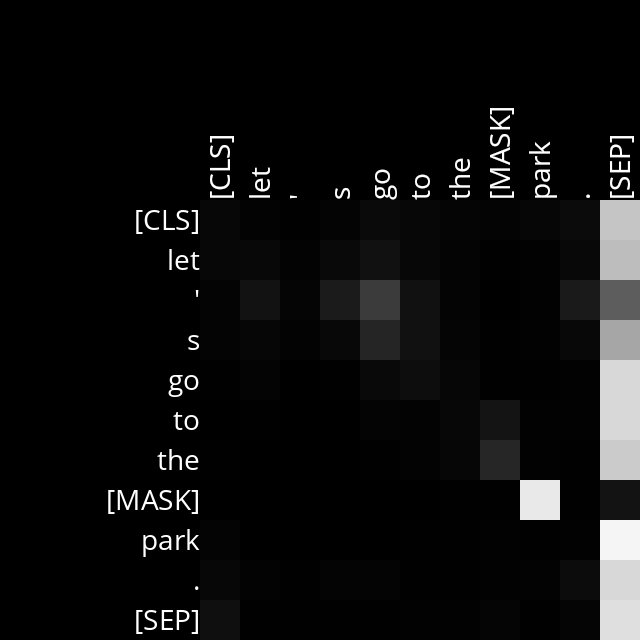
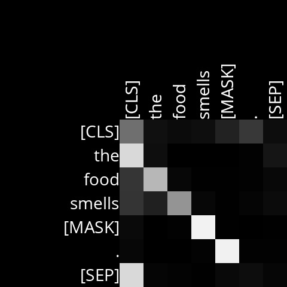

# Analysis

## Layer 7, Head 6

Sentence used: Let's go to the [MASK] park.

Here, the [MASK] strongly corresponds to the noun park. In this case [MASK] is most likely a noun. Here, a noun pays attention to another noun.

Example Sentences:
- Let's go to the amusement park.
- Let's go to the water park.

## Layer 3, Head 5

Sentence used: The food smells [MASK].

Here, the [MASK]  corresponds to the verb smells. Here, a verb pays attention to an adjective.

Example Sentences:
- The food smells delicious.
- The food smells amazing.

